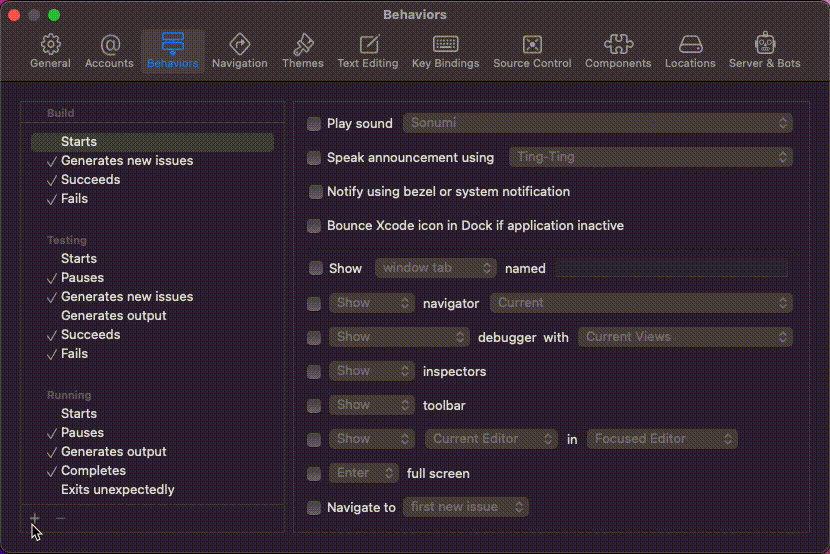

# xcode-clang-format
use `clang-format` in xcode

### Install [Homebrew](https://brew.sh/):

```
/usr/bin/ruby -e "$(curl -fsSL \
    https://raw.githubusercontent.com/Homebrew/install/master/install)"
```

### Install [`clang-format`](https://clang.llvm.org/docs/ClangFormat.html):

```
brew install clang-format
```

### Clone this repository:

```
cd <where-you-want-it>
git clone https://github.com/salmonocean/xcode-clang-format.git
```

### Add it as a behavior to Xcode:



